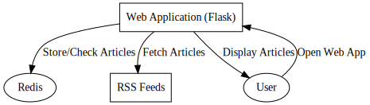

NOSQL RSS Feed Web aplikacija
Uvod

Ova veb aplikacija je dizajnirana da dohvata, kešira i prikazuje članke iz različitih RSS izvora. Izgrađena je koristeći Python sa Flask okvirom i koristi Redis za keširanje. Cilj je da se pruži brz pregled različitih tema tako što će se članci preuzimati iz više izvora.

Sistemska arhitektura
Komponente

    Veb aplikacija: Građena koristeći Flask, služi kao frontend i sadrži logiku za dohvatanje i keširanje članaka.
    Redis: In-memory skladište podataka koje se koristi za keširanje članaka.
    RSS izvori: Veb aplikacija preuzima članke iz ovih izvora.

Tok podataka

    Korisnik otvara veb aplikaciju.
    Flask proverava Redis da vidi da li članci za svaku grupu postoje.
    Ako ne, Flask dohvata članke iz RSS izvora i smešta ih u Redis.
    Flask izvlači keširane članke iz Redisa i prikazuje ih korisniku.

Tok komunikacije

    Veb aplikacija → Redis: Čuva/proverava članke i njihov broj.
    Veb aplikacija → RSS izvori: Dohvata članke ako nisu u Redisu.
    Veb aplikacija → Korisnik: Prikazuje članke.

Korisnički tok

    Prva poseta: Svi članci se preuzimaju sa veba i keširaju u Redisu. Članci se prikazuju korisniku.
    Naknadne posete: Članci se dohvataju iz Redisa i prikazuju. Ako su objavljeni novi članci, oni će biti dohvaćeni i ažurirani u Redisu.

Pregled koda
Ključne funkcije

    load_feeds_from_yaml(): Čita URL-ove RSS izvora iz YAML fajla.
    parse_feed(): Koristi feedparser biblioteku za dohvatanje članaka sa datog URL-a RSS izvora.
    extract_or_parse_image(): Pokušava da pronađe sliku za svaki članak, bilo iz njegovih metapodataka ili analizom njegovog sadržaja.
    fetch_and_cache_articles(): Dohvata članke za svaku grupu i kešira ih u Redisu.

Strategija keširanja

Ključevi u Redisu su postavljeni na sledeći način:

    {grupa}: Sadrži sve članke za grupu (npr. 'Tech', 'Sports').
    {ime_izvora}_article_count: Sadrži broj članaka za određeni izvor (npr. 'Forbes_article_count').

Zavisnosti

    Python 3.x
    Flask
    Redis
    feedparser
    BeautifulSoup
    PyYAML

Kako pokrenuti

    Instalirajte sve zavisnosti.
    Pokrenite Redis na podrazumevanom portu.
    Pokrenite app.py da biste započeli Flask aplikaciju.
    Otvorite veb pregledač i idite na http://localhost:5000.

Buduća unapređenja

    Dodajte paginaciju.
    Implementirajte funkcionalnost pretrage.

Zaključak

Ova veb aplikacija služi kao konsolidovana platforma za pristup člancima iz različitih tema i izvora. Korišćenje Redisa za keširanje čini aplikaciju efikasnijom smanjujući potrebu za dohvatanjem članaka sa veba pri svakoj poseti.

